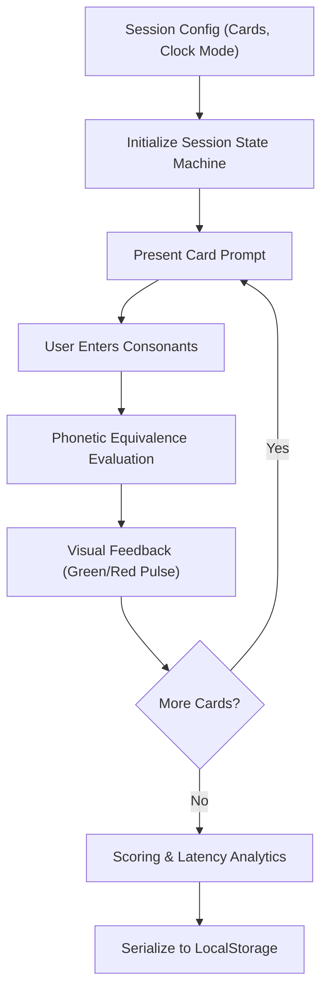

# Specification: Major System Trainer Engine & Cue Card Interface

## Architectural Overview
This application is a decoupled mnemonic drill engine with a cyber/arcade dark mode frontend.
The architecture is strictly separated into four isolated layers:
1. **Domain Specification (`domain/systems/`):** Pure static data and phonetic validation classes. Completely unaware of UI, timers, or web runtime.
2. **Session Engine State Machine (`engine/`):** Pure state reducer handling card transitions, timing logs, and trial evaluation. Testable in 100% headless isolation.
3. **Presentation Layer (`components/`):** React 19 + Tailwind CSS. Renders views based on session state: Setup View -> Drill / Cue Card View -> Evaluation / Score View.
4. **Telemetry & Persistence (`storage/`):** LocalStorage adapter serializing immutable session summary runs.



---

## Immutable Data Contracts

### 1. Major System Mappings Schema
```typescript
export interface PhoneticMapping {
  readonly digit: string; // "0" - "9"
  readonly primaryConsonants: string; // e.g. "s, z"
  readonly acceptedTokens: readonly string[]; // lowercase normalized tokens, e.g. ["s", "z", "soft-c", "c"]
  readonly mnemonicHint: string; // e.g. "Zero starts with Z; S is the sound of zero"
}

export interface MemorySystemSpec {
  readonly id: string;
  readonly name: string;
  readonly mappings: readonly PhoneticMapping[];
}
```

### 2. Session Configuration & Trial Contracts
```typescript
export type ClockMode = 
  | { readonly type: "none" }
  | { readonly type: "perCard"; readonly limitMs: number }
  | { readonly type: "total"; readonly limitMs: number }
  | { readonly type: "stopwatch" };

export interface SessionConfig {
  readonly systemId: string;
  readonly cardCount: number; // e.g., 5, 10, 20, 50
  readonly clock: ClockMode;
  readonly seed: number;
}

export interface CardTrial {
  readonly sequenceIndex: number;
  readonly digit: string;
  readonly userRawInput: string;
  readonly normalizedInput: string;
  readonly isCorrect: boolean;
  readonly latencyMs: number;
  readonly timedOut: boolean;
  readonly timestamp: number;
}

export interface SessionResult {
  readonly sessionId: string;
  readonly config: SessionConfig;
  readonly completedAt: number;
  readonly trials: readonly CardTrial[];
  readonly metrics: {
    readonly totalCount: number;
    readonly correctCount: number;
    readonly accuracyRate: number;
    readonly totalDurationMs: number;
    readonly averageLatencyMs: number;
    readonly fastestLatencyMs: number;
    readonly slowestLatencyMs: number;
  };
}
```

---

## Failure Modes & Mitigation (Hardened Engineering)

1. **Timer Drift & Background Tab Throttling:**
   - *Risk:* Browser background tab timer throttling corrupts latency stats or fires card switches late.
   - *Mitigation:* The engine computes time deltas using monotonic timestamps (`performance.now()`) recorded at trial activation vs. submission, rather than counting ticks.

2. **Accidental Multi-Keystroke & Input Race Conditions:**
   - *Risk:* Rapid double-pressing of Enter submits an empty answer for the next card immediately.
   - *Mitigation:* The input controller enforces a mandatory 250ms debounced lock state during transition between cards.

3. **Phonetic Normalization Edge Cases:**
   - *Risk:* Input variations like `"SH"`, `"sh "`, `"ch"`, or `"soft g"` failing on case or punctuation.
   - *Mitigation:* A strict regex-based normalizer trims whitespace, converts to lowercase, strips leading/trailing non-alphanumeric punctuation, and maps phonetic synonyms before checking against `acceptedTokens`.

4. **Zero State / LocalStorage Corruption:**
   - *Risk:* Corrupted historical score entries crashing the analytics dashboard.
   - *Mitigation:* All reads from `localStorage` pass through a strict schema validation check with fallback to a clean state.

---

## Affected Files
1. `package.json` - Vite + React 19 + Tailwind CSS + Lucide Icons + Vitest
2. `src/domain/majorSystem.ts` - Immutable phonetic mappings and normalizer
3. `src/engine/sessionStateMachine.ts` - Pure session state machine reducer
4. `src/components/SetupView.tsx` - Configuration view (card count, timer mode)
5. `src/components/CueCardView.tsx` - Cyber/Arcade cue card drill with instant feedback pulse
6. `src/components/ScoreView.tsx` - End-of-run telemetry, accuracy breakdown, latency stats
7. `src/App.tsx` - Top-level presentation coordinator
8. `tests/majorSystem.test.ts` - Unit test suite for phonetic validation
9. `tests/sessionStateMachine.test.ts` - State machine transition tests

---

## Step-by-Step Micro-Tasks (For the Builder)
1. **Initialize Git & Repository Workspace:** Configure `.gitignore`, initialize Git repo, and attach remote `https://github.com/ranimela/memory-training.git`.
2. **Project Scaffolding:** Set up Vite + React + TypeScript + Tailwind CSS dependencies.
3. **Core Domain Layer (`src/domain/`):** Implement `majorSystem.ts` with complete 0–9 phonetic equivalence classes and input normalizer. Write and run unit tests.
4. **Session Engine (`src/engine/`):** Implement pure state reducer with `performance.now()` latency tracking and debounced transition guards. Write and run unit tests.
5. **Cyber/Arcade Presentation Components (`src/components/`):**
   - Implement `SetupView` with card count selector (5, 10, 20, Custom) and clock options (None, Stopwatch, Per-Card 3s/5s, Total 60s).
   - Implement `CueCardView` with neon cyber aesthetic, high-contrast typography, keyboard auto-focus, and green/red flash feedback.
   - Implement `ScoreView` with accuracy badges, average response speed, and per-card review list.
6. **Git Remote Push:** Commit all source files and push initial production baseline to GitHub.

---

## Verification Criteria
- `npm test` runs Vitest and passes 100% of domain and state machine unit tests.
- UI renders with zero console errors.
- Timer operates accurately even if browser tab is unfocused.
- Remote repository `origin/main` is up-to-date with working code.

---

## Context Pruning
The Builder is permitted to read only:
1. `src/domain/majorSystem.ts`
2. `src/engine/sessionStateMachine.ts`
3. `src/components/CueCardView.tsx`

